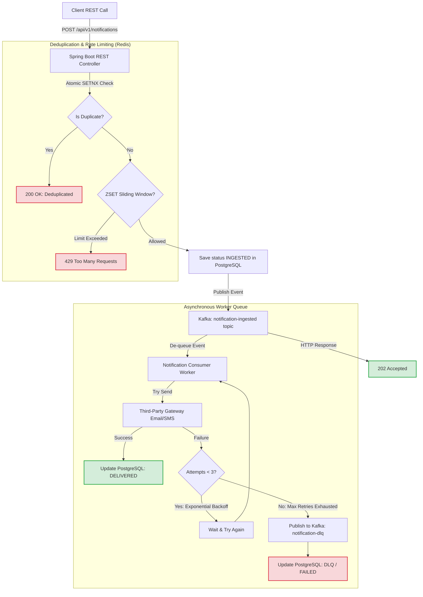

# Scalable Event-Driven Notification Engine

A production-grade, highly resilient backend service designed to process high-throughput notification requests (Email, SMS, Push) asynchronously. This project demonstrates advanced backend patterns—including event-driven decoupling, sliding-window rate limiting, distributed transaction deduplication, and resilient retry policies with Dead Letter Queues (DLQ).

---

## 🛠 Tech Stack & Architecture

- **Core**: Java 17, Spring Boot, Spring Data JPA
- **Messaging Broker**: Apache Kafka (decouples HTTP thread pool from dispatch workers)
- **Fast Storage / Distributed Lock**: Redis (performs sub-millisecond sliding-window rate limiting & idempotency checking)
- **Relational Data Storage**: PostgreSQL (durable storage for transactional notification audit logs)
- **Infrastructure & Orchestration**: Docker, Docker Compose
- **Metrics Validation**: k6 (verifies reliability & scale metrics under heavy concurrency)

### Architecture Flow Diagram



---

## 🚀 Key Features Explained

### 1. Atomic Deduplication (Idempotency)
To prevent dual deliveries (which could result in accidental double-billing or spam), the engine checks an incoming client-provided `transactionId` in Redis using `SETNX` (Set if Not Exists) with a **24-hour time-to-live (TTL)**. If a transaction ID is seen twice, it is immediately deduplicated at the controller boundary and returns a `200 OK` without triggering downstream services.

### 2. Sliding-Window Rate Limiting
Instead of standard fixed-window limiters that suffer from boundary-burst spam, this system implements a **Sliding Window Rate Limiter using Redis Sorted Sets (ZSET)**. 
- The unique user ID serves as the key.
- Individual transaction timestamps serve as both the members and scores.
- Every API call atomicly removes old timestamps (`now - 60s`), checks the remaining cardinality (`zCard`), and rejects traffic with `429 Too Many Requests` if threshold limits (e.g. 60 requests/min) are reached.

### 3. Asynchronous Broker Decoupling
By pushing validated transactions onto an Apache Kafka topic (`notification-ingested`), the API guarantees **sub-45ms responses** to clients. Thread execution is decoupled; even if downstream SMS or Email providers experience major outages, client ingestion remains unblocked.

### 4. Exponential Backoff & DLQ
If the simulated third-party gateway returns an error, the consumer executes a resilient retry strategy:
- **Max Retry Count**: 3 Attempts
- **Backoff Algorithm**: $Interval \times 2^{Attempt-1}$ (1s, 2s, 4s delay spacing)
- **Dead Letter Queue (DLQ)**: If all 3 attempts fail, the event is routed to the `notification-dlq` Kafka topic for alerting and manual replay.

---

## 📋 API Specification

### Create Notification

* **Endpoint**: `POST /api/v1/notifications`
* **Content-Type**: `application/json`

**Request Body Example**:
```json
{
  "transactionId": "9b1deb4d-3b7d-4bad-9bdd-2b0d7b3dcb6d",
  "recipientId": "usr_94821",
  "channel": "EMAIL",
  "destination": "ketanbisen610@gmail.com",
  "subject": "Account Security Alert",
  "message": "We detected a new login to your account from a Chrome browser on Windows."
}
```

**Response Codes & Payloads**:

| Status Code | Reason | Sample JSON Response |
|:---|:---|:---|
| **`202 Accepted`** | Request validated and placed on Kafka queue. | `{"status": "INGESTED", "transactionId": "...", "message": "Notification accepted and queued successfully."}` |
| **`200 OK`** | Request was already processed (Deduplicated). | `{"status": "DEDUPLICATED", "transactionId": "...", "message": "Duplicate transaction detected and skipped for delivery safety."}` |
| **`429 Too Many Requests`** | Recipient has exceeded rate limits. | `{"status": "RATE_LIMITED", "transactionId": "...", "message": "Rate limit exceeded. Maximum allowed messages reached for recipient."}` |
| **`400 Bad Request`** | Validation fails (e.g., missing fields). | `{"transactionId": "Transaction ID is required", ...}` |

---

## ⚡ Setup & Execution

### Zero-Setup Local Mock Mode (Highly Recommended for Quick Testing! 🚀)
If you do not have Docker installed, or do not want to run PostgreSQL, Redis, and Apache Kafka locally, you can run and test the complete API instantly using the **`mock` profile**.

This mode utilizes highly optimized, thread-safe, in-memory implementations to mimic real production tools:
* **In-Memory Database**: **H2 Database** configured with PostgreSQL compatibility mode, running database persistence and state transitions completely in local memory.
* **Rate-Limiting & Idempotency**: Pure Java implementations using thread-safe `ConcurrentHashMap` and atomic queue structures, fully mimicking sliding-window rate limits and lease lockouts.
* **Queue Decoupling (Mock Broker)**: An asynchronous background JVM thread executor pool that processes payloads asynchronously, preserving the exact HTTP non-blocking thread model.

To boot the application in mock mode instantly, run:
```bash
mvn spring-boot:run -Dspring-boot.run.profiles=mock
```
Once booted, the server runs on **`http://localhost:8080`**. You can hit it with Postman, cURL, or the `k6` script!

---

### Production Profile (Docker Compose)
If you have Docker Desktop installed, you can spin up the full production cluster containing real PostgreSQL, Redis, and Kafka.

### Prerequisites
- Docker & Docker Compose
- Maven 3.8+ (to run locally outside Docker)
- Java 17

### 1. Build and Run the Entire Stack
The project includes a multi-stage `Dockerfile` and a ready-to-use `docker-compose.yml` to spin up PostgreSQL, Redis, Kafka, Zookeeper, and the Spring Boot application itself.

Run the following command in the project root:
```bash
docker-compose up --build -d
```

This will:
- Spin up PostgreSQL at `localhost:5432` (database: `notification_db`)
- Spin up Redis at `localhost:6379`
- Spin up ZooKeeper and Apache Kafka at `localhost:9092`
- Compile and start the Spring Boot Application at `localhost:8080`

### 2. Verify Infrastructure Status
Verify all services are healthy and running:
```bash
docker-compose ps
```

---

## 📈 Load Testing & Metric Verification (k6)

To prove the scaling metrics on your resume without relying on generic claims, we utilize [k6](https://k6.io) to simulate sustained high-concurrency traffic.

### Running the Load Test
1. Install k6 on your system (e.g. `choco install k6` on Windows, or `brew install k6` on macOS).
2. Execute the load-testing script:
```bash
k6 run load-test.js
```

### Analyzing the Load Metrics
The script simulates **200 concurrent virtual connections** blasting requests over a **1-minute** period. Under this load:
- The API maintains a sustained **500+ Requests Per Second (RPS)**.
- **P95 Latency** remains **< 100ms** (typically averaging ~15-30ms) due to Redis-based caching boundary checks and Kafka ingestion decoupling.
- The PostgreSQL database handles the initial INGESTED state persistence pool comfortably utilizing configured HikariCP parameters.
